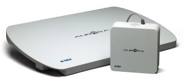

Background
==========

Electromagnetic tracking system
-------------------------------

Electromagnetic tracking systems are nowadays used for supporting a variety of surgeries
(Endoscopy, Cardiology, Interventional imaging …).
In most cases it is used for tracking (the tip of) surgical instruments.
The instruments are usually visualized during a surgery in order to correctly position and navigate
a needle for example. Such data is often used in combination with overlaying pre-operatively acquired MRI
or CT images. A major advantage of electromagnetic tracking systems compared to other tracking systems are,
that no line-of-sight between the field generator and the sensor / tracking point is necessary.
Optical tracking systems have to deal e.g. with such occlusion.

In electromagnetic tracking systems, a field generator is used in order to cover an
object within varying magnetic fields. With that such a known volume is created in which sensor can be tracked.
Due to the varying magnetic fields the sensors are induced with a certain voltage,
which can be interpreted for position and orientation.
In this project we’ll use a Table Top Field Generator of the NDI Aurora series.

In the left picture are two different field generators of the NDI Aurora series.
In the right image it shown, how such generator is used to create a known measurement volume (in blue).
The circles are the varying magnetic field. If a sensor coil is attached to a surgical
instrument and moved inside the volume, the tracking system can return the positional and orientation data.

.. image:: imgs/table_human.*
    :height: 150px

The sensor data for the NDI Aurora system which our project uses have six degrees of
freedom (6DOF). The three translation values on the x, y and z-axes (in mm),
and the three rotation values roll, pitch and yaw (in degree).
The raw sensor data describes the orientation in quaternion, which will be explained
in the section below.
To be precise it is denoted as *unit quaternions*.

.. image:: imgs/euler.*
    :height: 150px

Quaternions
-----------

Quaternions can be used for describing a **rotation around an arbitrary axis**.
Advantages of quaternion are the avoidance of gimbal lock (problem with systems like Euler angles)
and it is faster and more compact than matrices.

A quaternion q can generally be represented as followed:

.. math::
    q=\overbrace{a}^\text{real part}+\overbrace{bi+cj+dk}^\text{imaginary part}

where *a,b,c,d* are real numbers and **i,j,k** represent complex number and
are also called quaternion units.
The quaternion can also be describing in two parts:
In green the real part (or scalar) and in red the imaginary part (or vector part).

The conjugation of a quaternion is similar to the conjugation of
complex numbers as is noted as followed:

.. math::
    \bar{q} = a-bi-cj-dk

The norm of a quaternion is calculated with the square root of the product of a quaternion. If the norm is one,
such quaternion is denoted as **unit quaternion**.

.. math::
    \left\|  q \right\| = \sqrt{q\bar{q}} = \sqrt{a^2+b^2+c^2+d^2}=1

Regarding rotations quaternion describe the two important parts:

 * Rotation angle :math:`\theta`  – represented with the real part :math:`a`
 * Rotation axis :math:`(X,Y,Z)` -  represented with the imaginary part :math:`bi-cj-dk`

For easier explanation we will apply this with the received values
from the NDI Aurora sensor coils and denote this as following:

.. math::
    \bar{q} = a-bi-cj-dk = Q_0+Q_x+Q_y+Q_z

The rotation angle :math:`\theta` can be calculated as followed:

.. math::
    \theta =  2 \cos^{-1}{(Q_0)}

The rotation axis :math:`(X,Y,Z)` will be represented as:

.. math::
    (Q_x,Q_y,Q_z)

For further reading please refer to https://mathepedia.de/Quaternionen.html.

We also like to thank our math professor Benjamin Himpel for supporting us understanding
quaternions and the calculus behind it.

